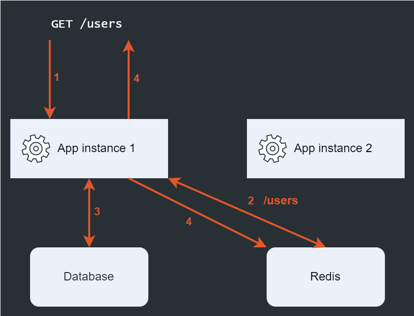
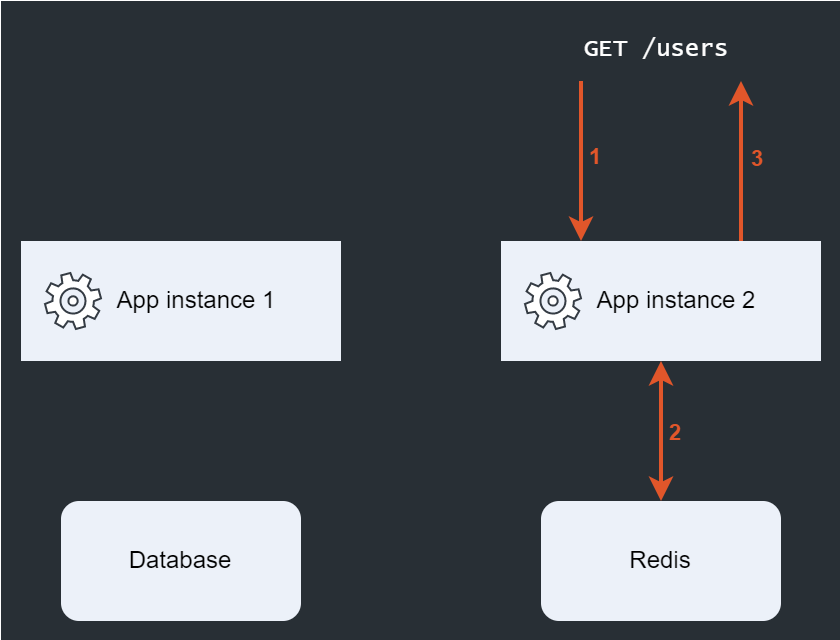
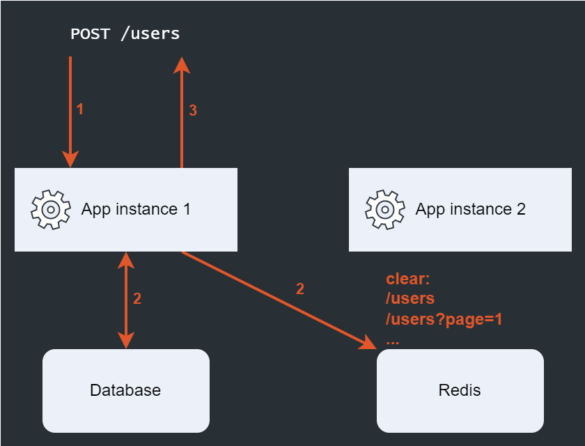

# Overview

### Принцип хранения данных

Ключ генерируется из URL, по которому выполняется запрос.

Пример ключей в системе кеширования:

```
/users?search=username
/users?page=1&limit=10
```

### В кэш сохраняются данные:
 - Status Code
 - Content-Type
 - Body

### Диаграмма работы

1. Первый запрос на URI `/users`
   
   Этапы 4 выполняются параллельно (одновременно отдаётся запрос пользователю и сохраняются данные в кеш).



1. Второй запрос на URI `/users`



3. Срабатываение триггера при `POST` запросе
   
   Этапы 2 выполняются параллельно (одновременно запрос поступает в обработку приложению и очищаются данные в кеше).



# Триггеры

Триггеры позволяют сбрасывать кэш, если обнаруживают соответствие запроса каким-либо описанным критериям. Вы можете самостоятельно добавлять триггеры, главное что бы они совпадали с интерфейсом:

```
type Trigger interface {
	Comparable(*http.Request) bool
}
```

## Триггеры по-умолчанию

### URI Comparing

Для кэша объявляется триггер "TriggerURL" с двумя полями:
- Methods (HTTP Methods)
- URI (URI in regular expression syntax)

Если хотя бы один запрос будет подходить по шаблону URI и методу, то кэш будет сброшен для данного обработчика.

```go
r.GET("/users", cache.Cache(cacheTime, &gogincache.TriggerURL{
	Methods: gogincache.DefaultUpdateMethods,
	URI: ".*/users.*"
}), users.List())

r.POST("/users", users.Create())
```

# Example

```go
import (
	lib "github.com/redis/go-redis/v9"
	"example.local/go-gin-cache"
	"example.local/go-gin-cache/redis/goredis/v9"
)

var (
	// Время кеширования - 3 минуты
	cacheTime = 3 * time.Minute
)

func main(
	router := gin.New()

	// Инициализируем библиотеку и передаём клиент
	// для взаимодействия с сервисом кеширования.
	cache := gogincache.New(redispool)

	// Устанавливаем глобальный Middleware <CacheRouter>.
	// Он проверяет все запросы на соответствие триггерам,
	// если запрос совместим с каким-либо триггерром, то
	// выполняется сброс кеша.
	r.Use(cache.CacheRouter())

	// Получение списка пользователей с использованием кеша.
	// Для сброса кеша используется триггер, срабатывающий
	// при вызове методов создания или изменения пользователя.
	r.GET("/users", cache.Cache(cacheTime, &gogincache.TriggerURL{
		Methods: gogincache.DefaultUpdateMethods,
		URI: ".*/users.*"
	}), users.List())

	// При вызове этих методов кеш списка пользователей будет сброшен.
	r.POST("/users", users.Create())
	r.PATCH("/users/:USER", users.Patch())
)
```